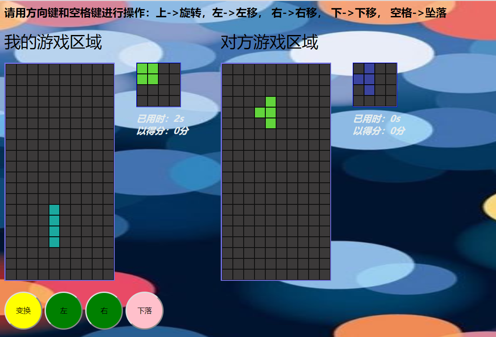

# 基于webscket的双人俄罗斯

**这是一款基于webscket的双人在线火拼俄罗斯小游戏**

### 如何在本地运行

1. websocket 本地运行俄罗斯方块需要安装node环境

2. `Git clone` 下来之后

3. 进入项目目录 node wsServer就可以可以了

4. 要是你想部署到服务器上，或者想永久运行这个项目 

   先在本地或服务器`npm install -g forever`

    然后 `forever wsServer.js`就可以了

   这样你退出控制界面也可以运行。 

**在线可访问[39.106.173.77](39.106.173.77)进行查看**

页面效果如下： 

